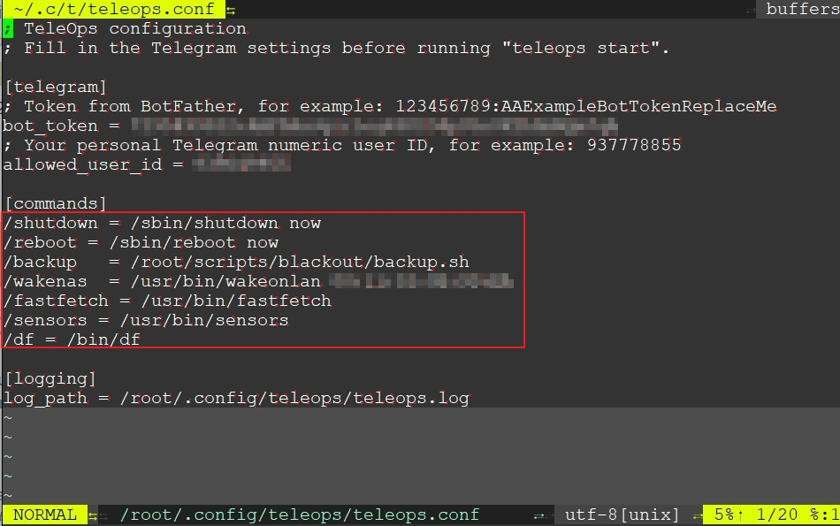
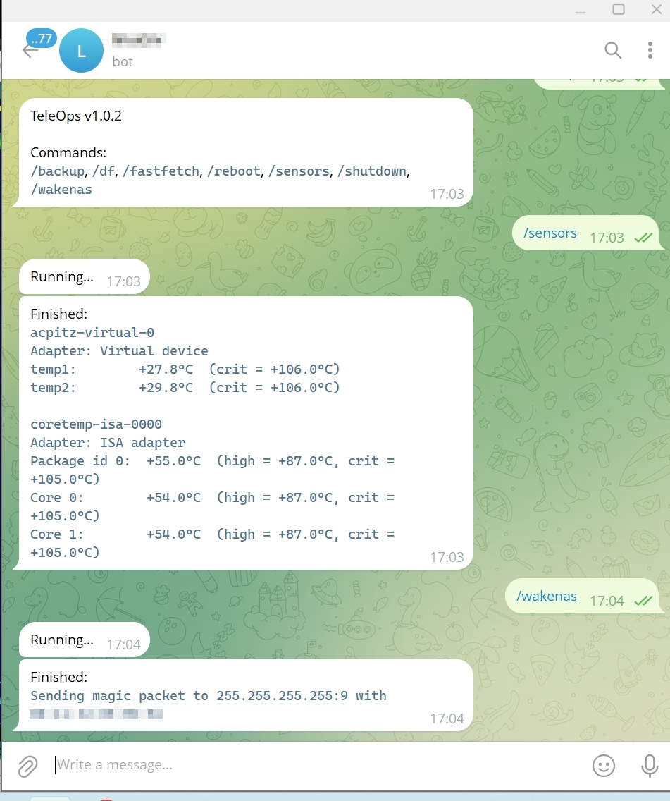

# 🤖 TeleOps

TeleOps is a small self-hosted Telegram host controller written in Go.

It lets you expose a fixed set of host commands through a Telegram bot, with a simple INI config, explicit lifecycle commands, and no external service dependencies.

## ✨ Features

- Cross-platform: Linux and Windows
- Explicit config lifecycle with `teleops init`
- Foreground process model with `start`, `stop`, `restart`, and `status`
- PID-file based process control
- Command allowlist from config
- Command output returned directly in Telegram
- Local file logging
- Simple release tooling for GNU Make and PowerShell

## 🔒 Security Notes

TeleOps is intended for trusted, self-hosted environments.

- Anyone who gains control of your Telegram bot token can interact with the bot.
- Anyone who can send messages from the configured Telegram user ID can execute the configured commands.
- Commands run on the host machine with the privileges of the TeleOps process.
- Only expose commands you are comfortable running remotely.
- Prefer dedicated, low-privilege accounts where possible.

## 📦 Install

### Build locally

```bash
go build -o teleops ./cmd
```

### Build release archives

GNU Make environments:

```bash
make release
```

Windows PowerShell:

```powershell
powershell -ExecutionPolicy Bypass -File .\build-release.ps1
```

## 🚀 Usage

### 1. Initialize config

```bash
teleops init
```

If you want to use a custom config path:

```bash
teleops --config ./teleops.conf init
```

If the config already exists and you want to regenerate it:

```bash
teleops init --force
```

### 2. Edit config

Default config path:

```text
~/.config/teleops/teleops.conf
```

You can override it with `--config /path/to/teleops.conf` or `TELEOPS_CONFIG`. The `--config` flag has higher priority.

Example:

```ini
[telegram]
bot_token       = <your-telegram-bot-token>
allowed_user_id = <your-telegram-user-id>

[commands]
/shutdown = /sbin/shutdown now
/restart  = /sbin/reboot now

[logging]
log_path        = ~/.config/teleops/teleops.log
```

Where:

- `bot_token` is the token from BotFather, for example `123456789:AAExampleBotTokenReplaceMe`
- `allowed_user_id` is your personal Telegram numeric user ID, for example `937778855`

## 📸 Screenshots

Example command definitions in config:



Example command execution in Telegram:



### 3. Start TeleOps

```bash
teleops start
```

With an explicit config path:

```bash
teleops start --config /etc/teleops/teleops.conf
```

### 4. Check status

```bash
teleops status
```

### 5. Stop TeleOps

```bash
teleops stop
```

### 6. Restart TeleOps

```bash
teleops restart
```

## ⚙️ Service Examples

TeleOps runs as a foreground process. For unattended operation, supervise it with
an external service manager.

### Linux

A `systemd` example is included at `services/linux/teleops.service`.

Typical install flow on Ubuntu:

```bash
sudo cp services/linux/teleops.service /etc/systemd/system/teleops.service
sudo systemctl daemon-reload
sudo systemctl enable teleops
sudo systemctl start teleops
sudo systemctl status teleops
```

Before enabling it, review these placeholders in the unit file:

- `User=teleops`
- `Group=teleops`
- `HOME=/home/teleops`
- `TELEOPS_CONFIG=/home/teleops/.config/teleops/teleops.conf`

### Windows

Because TeleOps is not a native Windows service binary, run it through a wrapper
such as NSSM. An example installer script is included at
`services/windows/install-nssm.ps1`, with extra notes in
`services/windows/README.md`.

## ⌨️ Commands

```text
teleops [--config path] [--force] init
teleops [--config path] [--pid-file path] <start|stop|restart|status>
teleops [-version] [-help]
```

## 📄 Configuration

Config sections:

- `[telegram]`
- `[commands]`
- `[logging]`

Configuration lookup priority:

1. `--config`
2. `TELEOPS_CONFIG`
3. `~/.config/teleops/teleops.conf`

Environment variable overrides:

- `TELEOPS_CONFIG`
- `TELEOPS_TOKEN`
- `TELEOPS_USER_ID`
- `TELEOPS_LOG`

Default PID file:

- `~/.config/teleops/teleops.pid`

## 🌱 Project Status

TeleOps is intentionally small and minimal. It is designed to be easy to audit, easy to self-host, and easy to adapt.

## ⚖️ License

MIT. See [LICENSE](LICENSE).
